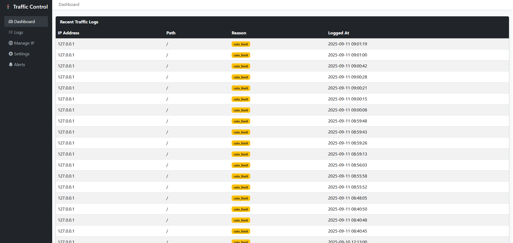
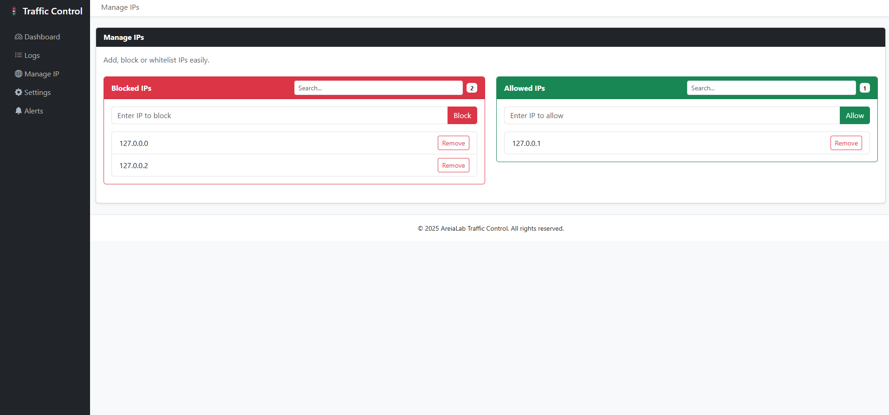
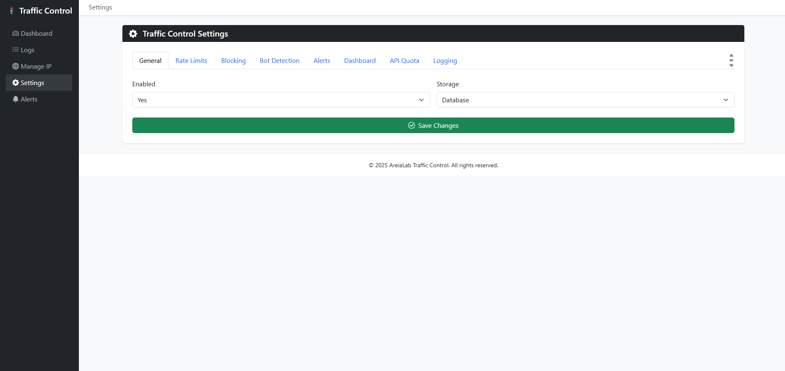

# Laravel Traffic Control 🚦


A full-featured **traffic control & security toolkit** for Laravel.  
It provides **rate limiting, IP black/whitelisting, bot detection, request quotas, alerts, logging, and a monitoring dashboard**.

---

## ✨ Features

- 🔒 **Advanced Rate Limiting** (per-IP, per-user, per-route, per-role, per-plan)
- 🌍 **IP Control**: Whitelist, Blacklist, TOR/VPN blocking
- 🤖 **Bot & Crawler Detection** using User-Agent patterns
- 📊 **Traffic Dashboard**: Visualize blocked/allowed requests
- 📑 **Logging** of suspicious/blocked requests with purge command
- 🔔 **Alerts** (Slack, Email) on suspicious spikes
- 🚦 **API Quotas** (daily, monthly, per-user, per-plan)
- 🧩 **Custom Rules**: Extend with your own blocking logic (GeoIP, maintenance windows, etc.)
- ⚡ **Request Queueing** (optional future feature)

---

## 📦 Installation

Install via Composer:

```bash
composer require areia-lab/laravel-traffic-control
```

Publish configuration and migrations:

```bash
php artisan vendor:publish --provider="AreiaLab\TrafficControl\TrafficControlServiceProvider" --tag="traffic-config"
php artisan vendor:publish --provider="AreiaLab\TrafficControl\TrafficControlServiceProvider" --tag="traffic-migrations"
php artisan migrate
```

(Optional) Publish dashboard views:

```bash
php artisan vendor:publish --provider="AreiaLab\TrafficControl\TrafficControlServiceProvider" --tag="traffic-views"
```

---

## 📸 Screenshots

<div style="display:flex; gap:1rem; flex-wrap:wrap;">



</div>

---

## ⚙️ Configuration

Edit `config/traffic.php`:

```php
return [
    'enabled' => env('TRAFFIC_CONTROL_ENABLED', true), // Enable/disable globally
    'storage' => env('TRAFFIC_CONTROL_STORAGE', 'redis'), // redis | database | file

    'rate_limits' => [
        'default' => ['requests' => 60, 'per' => 60],
        'api' => ['requests' => 120, 'per' => 60],
    ],

    'ip' => [
        'block_tor' => true,
        'blacklist' => [],
        'whitelist' => [],
    ],

    'bot_detection' => [
        'enabled' => true,
        'user_agents' => ['bad-bot'],
    ],

    'alerts' => [
        'slack' => env('TRAFFIC_CONTROL_SLACK_WEBHOOK'),
        'email' => env('TRAFFIC_CONTROL_ALERT_EMAIL', 'admin@example.com'),
        'threshold' => env('TRAFFIC_CONTROL_ALERT_THRESHOLD', 1000),
    ],

    'dashboard' => [
        'enabled' => true,
        'prefix' => 'traffic-control',
        'middleware' => ['web'],
    ],

    'api_quota' => [
        'default' => 10000,
    ],

    'logging' => [
        'log_blocked' => true,
        'log_sample_rate' => 1,
    ],
];
```

---

## 🚀 Usage

### Middleware

Apply globally in `app/Http/Kernel.php` or per route:

```php
Route::middleware(['traffic.control'])->group(function () {
    Route::get('/api/data', [ApiController::class, 'index']);
});
```

Custom per-route limit:

```php
Route::get('/heavy', [HeavyController::class, 'index'])
    ->middleware('traffic.control:200,60');
```

### Role/Plan-Based Limits

```php
if ($user = $request->user()) {
    $plan = $user->plan ?? 'free';
    $limit = config("traffic-control.rate_limits.$plan", config('traffic-control.rate_limits.default'));
}
```

### API Quotas

```php
use AreiaLab\TrafficControl\Facades\TrafficManager;

if (!TrafficManager::checkQuota($user->id)) {
    return response()->json(['error' => 'API quota exceeded'], 429);
}
```

### Dashboard

```php
Route::get('/admin/traffic', function () {
    $logs = \AreiaLab\TrafficControl\Models\TrafficLog::latest()->limit(50)->get();
    return view('vendor.traffic-control.dashboard', compact('logs'));
})->middleware(['web', 'auth'])->name('traffic-control.dashboard');
```

### Alerts

Set `.env` variables:

```
TRAFFIC_CONTROL_SLACK_WEBHOOK=https://hooks.slack.com/services/XXXX
TRAFFIC_CONTROL_ALERT_EMAIL=admin@example.com
```

### Purging Logs

```bash
php artisan traffic-control:purge               # Purge logs older than 30 days
php artisan traffic-control:purge --days=90 --force
php artisan traffic-control:purge --all
php artisan traffic-control:purge --all --force
```

---

## 🧩 Extending

Create custom rules under `src/Rules/`:

```php
namespace AreiaLab\TrafficControl\Rules;

use Illuminate\Http\Request;

class GeoBlockRule
{
    public function handle(Request $request)
    {
        $country = $this->lookupCountry($request->ip());
        if (in_array($country, ['CN', 'RU'])) {
            return response('Not available in your region', 403);
        }
        return true;
    }

    protected function lookupCountry($ip)
    {
        return 'US';
    }
}
```

---

## 🛠 Roadmap

- Redis sliding window / leaky bucket limiter
- GeoIP/TOR/VPN detection integration
- Charts for dashboard
- Plan-based quota & billing hooks
- AI anomaly detection

---

## 🤝 Contributing

PRs are welcome!

- Follow **PSR-12** coding style
- Add **unit/feature tests**
- Update **README.md** when adding new features

---

## 📜 License

MIT © AreiaLab
